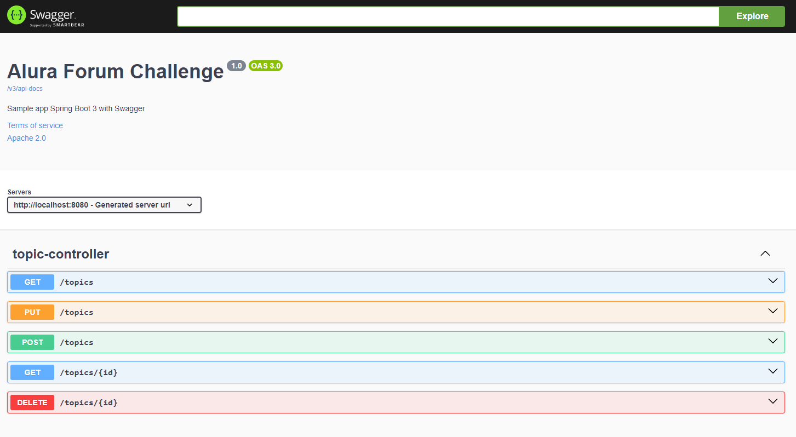

# Challenge ONE | Back End | Foro Alura 

     

 

<h3>Introducción</h3>

La api para el Foro Alura permite gestionar el acceso a los tópicos del 
mismo, manejando la creación, actualización, busqueda y eliminación de estos.

<h3>Sobre la funcionalidad de la app</h3>

     

    La aplicación inicialmente cuenta con el controlador y sus respectivas herramientas 
    que permiten dar manejo a la base de datos MySQL desde lo solicitado por el front por 
    medio de un contenido tipo json enviado.

<h3>Tecnologías implementadas</h3>
<ul>
  <li>spring framework</li>
  <li>java</li>
  <li>maven</li>
  <li>flyway</li>
  <li>mysql</li>
  <li>lombok</li>
  <li>spring data jpa</li>
  <li>Swagger</li>
</ul>

<h3>Créditos</h3>

Las bases del proyecto fueron facilitada por los tutores de la plataforma Alura, muchas gracias por el constante apoyo

